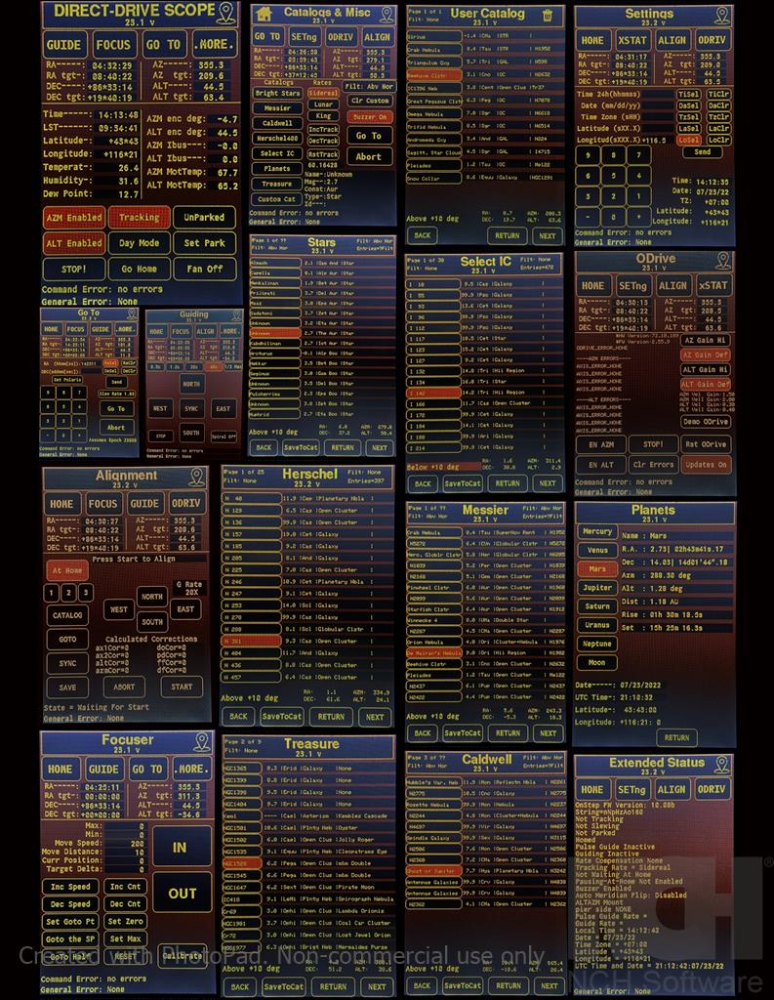
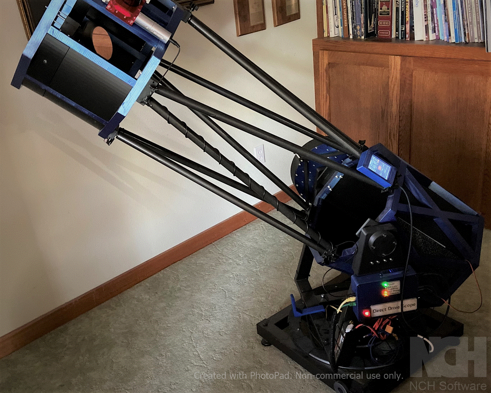

# DDScopeX

**D**irect **D**rive Tele**Scope** Plugin for OnStepX - A servo controlled F4.5 13" ALT/AZ GoTo Newtonian Telescope

* Author: Richard Benear 2021, 2022

The DDScopeX firmware implementation is a Plugin containing 17 different **Screens** (Pages)
for **Control** and **Status** using OnStepX core FW authored by Howard Dutton. 
OnStepX is firmware for a GoTo telescope controller running on many possible hardware platforms.
OnStepX provides the capability of adding Plugins to take advantage of the core firmware which is what DDScopeX does. 

>[OnStep README](./OnStep_README.md)

DDScopeX includes several celestial Catalogs that were leveraged from the catalog code
of the Smart Hand Controller also authored by Howard Dutton.

DDScopeX hardware uses Direct Drive motor technology by using 3-phase Axial Flux Permanent Magnet DC Motors (AFPMDC Motor). There is closed loop Servo control of motor positions using an ODrive subsystem and 2^14 (16,384 tick absolute encoders. The Motors,
Electronics, and Mechanics were designed and constructed by the author.

Motor closed-loop control is handled by the ODrive subsystem using either a serial
command channel or the CAN bus from DDScopeX. The config.h file contains the switch to select which communications mode is desired.  
For example: ``#define ODRIVE_COMM_MODE OD_CAN``

A menu and screens (pages) structure using a 3.5" LCD touchscreen is implemented.
The 3.5" Display is an electrically modified Rasperry Pi TFT LCD using the
SPI interface over an HDMI cable.

Many of the DDScope components were 3D printed with Carbon Fiber filaments. Mechanical design was done in **FreeCAD**.

The PC Board schematic and PCB design were done in ``KiCad``.

## Using DDSCope UI on other Hardware Platforms

It is possible to use the DDScope User Interface (UI) Screens on other hardware platforms by changing ``ODRIVE`` in ``#define AXIS1_DRIVER_MODEL ODRIVE`` in ``Config.h`` to whatever motor drive model you may be using. This should disable all ODrive specific code.

## DDScopeX specific files

These are listed to provide clarity of where the specific files are located for DDScopeX since not all of them are under the ``plugins`` directory.

### Top Level

* ``OnStepX/Config.h``
* ``OnStepX/Extended.config.h``
* ``OnStepX/src/Pinmap.Plugin.DDT.h``
* ``OnStepX/src/plugins/DDScope.cpp``
* ``OnStepX/src/plugins/DDScope.h``

### Screens (src/plugins/DDScope/screens/)

* Home (``HomeScreen.cpp``)
* Guide (``GuideScreen.cpp``)
* Focuser (``DCFocuserScreen.cpp``)
* GoTo (``GotoScreen.cpp``)
* Catalogs & More (``MoreScreen.cpp``)
* SHC Catalogs (``SHCCatScreen.cpp``)
  * General Stars
  * Messier
  * Caldwell
  * Herschel
  * IC
* Planets (``PlanetsScreen.cpp``)
* Treasure (``TreasureScreen.cpp``)
* Custom User (``CustomScreen.cpp``)
* ODrive ``(OdriveScreen.cpp``)
* Extended Status (``ExtStatusScreen.cpp``)
* Settings (``SettingScreen.cpp``)
* Alignment (``AlignScreen.cpp``)

### Supporting files

* ``OnStepX/src/plugins/DDScope/display/Display.cpp``: Common functions for Screens
* ``OnStepX/src/plugins/DDScope/display/UIElements.cpp``: Buttons and text support
* ``OnStepX/src/plugins/DDScope/display/NGC1566.bmp``: Bitmap of boot screen
* ``OnStepX/src/plugins/DDScope/display/icons.c``: Bitmaps of icons
* ``OnStepX/src/plugins/DDScope/odriveExt/ODriveExt.cpp``: Common functions for ODrive support
* ``OnStepX/src/plugins/DDScope/libCatalogs/mod1_treasure.csv``: Excel file of treasure catalog

### Key supporting packages and components

* OnstepX Firmware  
    Author: Howard Dutton, http://www.stellarjourney.com
* Multiple celestial catalogs and supporting files from the catalog portion of Smart Hand Controller(SHC)  
    Author: Howard Dutton, http://www.stellarjourney.com
    Author: Charles Lemaire, https://pixelstelescopes.wordpress.com/teenastro/
* Planet calculatons using Ephermeris Software  
    Author: Sebastien MARCHAND (www.marscaper.com)
* A catalog of sky "Treasures" from rDUINOScope on micro SD card  
    Author: Dessislav Gouzgounov (Desso)  
    PROJECT Website: (http://rduinoscope.byethost24.com)  
    Original file has been formatted differently for DDScopeX
* _Adafruit_ILI9486_Teensy_ by Steve Strong & Richard Palmer
* FlexCAN_T4 library by Antonio Alexander Brewer (https://github.com/tonton81/FlexCAN_T4)
* ODriveTeensyCAN library by Diablo Malaphor (/https://github.com/Malaphor/ODriveTeensyCAN.git). This library was forked from G-Levine. There is a local copy included in the DDScope fileset since it has been modified.

### ``.pio\libdeps\teensy41`` (imported libraries)

* Adafruit BME280 Library
* Adafruit BusIO
* Adafruit GFX Library
* Adafruit Unified Sensor
* Arduino
* Ephemeris
* ODriveArduino
* PID
* TinyGPSPlus
* FlexCAN_T4

## DDScopeX Features

DDScopeX provides 17 (touch)screens that support the functions of OnStepX and the ODrive motor controller. If the ``ODRIVE`` motor model is changed in ``Config.h`` to some other motor model, then there are 16 Screens since the ODrive Screen is not included.

### OnStepX Features Supported

* ESP32 WiFi which provides remote access to the Smart Web Server or Android/iPhone apps.
* GPS using BN220 (also support for BS280 (PPS signal input))  
* Temperature, Humidity, Pressure using BME280 sensor
* Remote DC Focuser servo control
* ASCOM driver works with Stellarium and Sky Planetarium
* Android App is functional
* iPhone App Gotomote is functional
* Not implemented: Ethernet (could be added with Wiznet 5500 shield)
* Not Implemented: Bluetooth (could be enabled)

### Telescope Hardware

* Complete mechanical design, including DC motors, done in FreeCAD
* 3D printed: 2/3 of mechanical design is 3D printed (carbon fiber PLA, PLE, ABS) (the rest is steel or Alum.). Used a Sidewinder X1 3D printer.
* ALT/AZM design using NEWT online software
* Optics: 13" Dia. f4.5 primary mirror from an ancient Obsession Scope
* Direct Drive 3-phase axial flux DC permanent magnent motors for both axis (AZM/ALT)
  * ALT motor is double motor for higher torque with two stators sandwiching a double sided rotor
  * AZM motor is a single motor built around 2 slew bearings
  * ALT/AZM motors are approxately 11" in diameter to get needed torque
* Closed loop control using CUI AMT23B Absolute encoders (16,384) for ALT and AZM axis
* Floating mirror cell design using 3D printed materials and Plop Cell Design SW
* Curved Vane Spyder for Secondary made by [1800Destiny](http://www.1800destiny.com/)
* Moonlight Focuser(DC motor) control with Focuser Touchscreen

### Telescope Electronics

* Teensy 4.1 primary CPU running 600 Mhz with Micro SD card storage
* ODrive 24 VDC motor controller board with open source firmware
* WiFi using ESP32 (Bluetooth not enabled)
* GPS (Lat, Long, Time, Date, Altitude)
* Temperature, Humidity, pressure, altitude
* Temperature Sensors monitoring inside DC 3-phase Motors
* DC Motor current monitoring
* Dynamic Gain control of DC 3-phase Motors
* Fan control
* 22.2 VDC LiPo Battery 5200 mAh
* Custom PC Board designed with KiCAD with spares pinned out for later additions
* 3.5" TFT LCD (Rpi) display with Touchscreen (modified to work on 3.3V and 16 bit SPI interface)
* CAN bus

### Other DDScope features

* Slew rate of 7 deg/sec. Trapezoidal move profile.
* The ability to store favorite objects from any catalog (except planets) to a Custom User Catalog on micro SD card
* Above Horizon filter for catalogs. All Sky Align Filter for Star Catalog.
* Display of target coordinates and real time updates of slewing coordinates
* Ability to set latitude, longitude, time, date, UTC when GPS is down
* Battery low warning (visual and auditory) plus battery voltage reading
* Real time ALT/AZM Encoder readings
* Night Mode for display/screen
* OnStep errors and ODrive errors displayed
* Auditory frequency-based feedback when either axis is being displaced from target (e.g loaded by wind or obstruction)

## Other Documentation

* **DDScopeX:** In process...will include PC Board, motor construction, and mount construction instructions.
* **OnStepX:** Detailed documentation, including the full set of features, detailed designs for PCBs, instructions on how to build a controller, how to configure the firmware for your particular mount, can all be found the [OnStep Group Wiki](https://groups.io/g/onstep/wiki/home).

## Change Log

* **DDScopeX** changes: Once released, versioning will take place.
* **OnStepX** changes: All the changes are tracked in git, and a detailed list can be accessed using the following git command:  
        _git log --date=short --pretty=format:"%h %ad %<(20)%an %<(150,trunc)%s"_

## Support

* DDScopeX specific: To be determined...  
* OnStepX specific: questions and discussion should be on the mailing list (also accessible via the web) at the [OnStep Group](https://groups.io/g/onstep/).

## License

DDScopeX and OnStepX are open source free software, licensed under the GPL.  
See [LICENSE.txt](./LICENSE.txt) file.

## Images

### Screens (Pages)

This composite picture (collage) shows all 17 screens contained in DDScopeX. The picture quality is not the best because the camera picks up and overempasizes the glow at top and bottom of screen. The pictures have been post processed to try and remove the glow, but this tends to darken them. The screens actually look much better when viewed live.

The Rasperry Pi TFT LCD does not have SPI read capability so it was not possible to do a
screen dump (using some custom code) to a bitmap (.bmp) file. This would have been the ideal way to get a true color representation of the Screens.

### DDScopeX Picture

### DDScopeX Video

[ to be done ]
